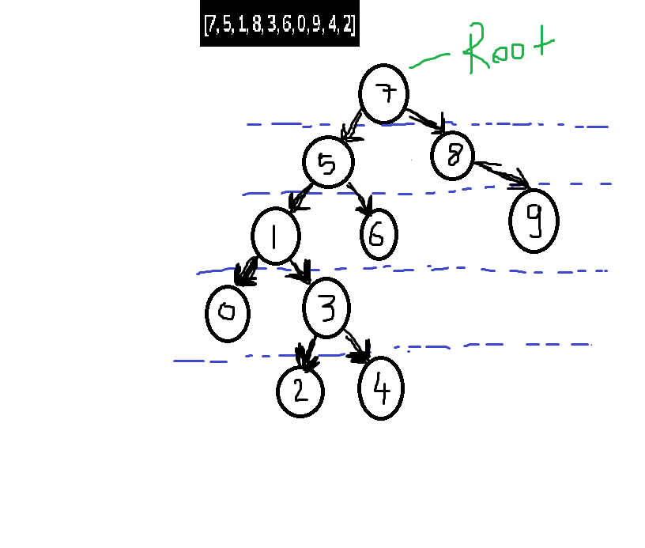

# Insert Sort Algorithm

- [ 22, 27, 16, 2, 18, 6 ]
- [ 16, 22, 27, 2, 18, 6 ]
- [ 2, 16, 22, 27, 18, 6 ]
- [ 2, 16, 18, 22, 27, 6 ]
- [ 2, 6, 16, 18, 22, 27 ]
- RESULT: 2,6,16,18,22,27

# Merge Sort Algorithm

- Second Array: 16,21,11,8,12,22
- [ 16, 21, 11 ] [ 8, 12, 22 ]
- [ 16 ] [ 21, 11 ]
- [ 21 ] [ 11 ]
- [ 8 ] [ 12, 22 ]
- [ 12 ] [ 22 ]
- RESULT: 8,11,12,16,21,22

# Binary Search Tree Algorithm

- [7, 5, 1, 8, 3, 6, 0, 9, 4, 2]

